# NBLK Customer Management App

A full-stack cloud application built on Microsoft Azure to demonstrate small business customer management.

## Live Demo
- **API:** https://nblk-functions-2026.azurewebsites.net/api/getcustomers

## Architecture

## Azure Services Used
- **Azure SQL Database** — stores customer data
- **Azure Functions** — serverless REST API
- **Azure RBAC** — role-based access control
- **Azure CLI** — infrastructure deployment
- **Azure Static Web Apps** — frontend hosting

## API Endpoints
| Method | Endpoint | Description |
|--------|----------|-------------|
| POST | /api/addcustomer | Add a new customer |
| GET | /api/getcustomers | Get all customers |
| DELETE | /api/deletecustomer?id={id} | Delete a customer |

## Tech Stack
- Node.js / Azure Functions v4
- Azure SQL Database (mssql)
- HTML / CSS / JavaScript frontend

## Author
Aditya Bhuran — MS Computer Science, Pace University 2026